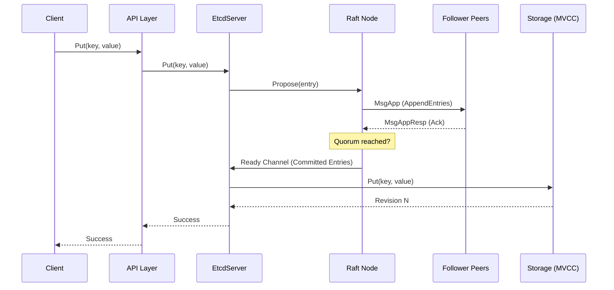
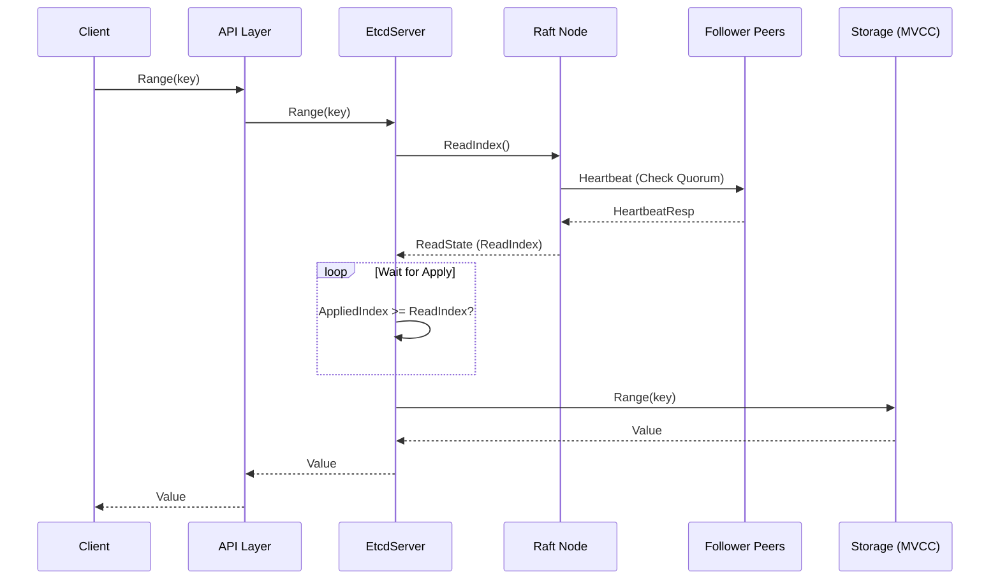
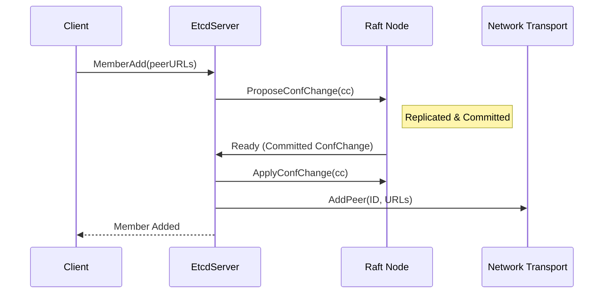

# Etcd Core Implementation Deep Dive

## 1. Introduction

This document provides a deep technical analysis of the core etcd implementation found in `vendor/go.etcd.io/etcd`. It is written for distributed systems engineers and aims to demystify the internal workings of etcd, focusing on architecture, consensus, persistence, and execution flows.

## 2. High-Level Architecture

Etcd is a strongly consistent, distributed key-value store. Its architecture is layered to separate the consensus logic (Raft) from the business logic (Server) and the storage engine (MVCC/BoltDB).

### 2.1 Component Layering

```mermaid
graph TD
    Client[Client (gRPC/HTTP)] --> API[API Layer (gRPC Server)]
    API --> Server[EtcdServer]

    subgraph Core Logic
        Server --> Consensus[Raft Node]
        Server --> Applier[Applier (State Machine)]
    end

    subgraph Storage Layer
        Applier --> MVCC[MVCC (Memory Index)]
        MVCC --> Backend[Backend (BoltDB)]
        Consensus --> WAL[WAL (Write Ahead Log)]
        Consensus --> Snapshot[Snapshot Storage]
    end

    Consensus -- Replication --> Network[Network Transport]
```

### 2.2 Key Components

1.  **EtcdServer** (`vendor/go.etcd.io/etcd/server/v3/etcdserver/server.go`): The central hub. It handles client requests, interacts with the Raft node, and applies committed entries to the storage.
2.  **Raft** (`vendor/go.etcd.io/raft/v3`): The consensus module. It implements the Raft algorithm (leader election, log replication). It is designed as a pure state machine: it takes inputs (messages) and produces outputs (actions), but does not handle network IO or persistent storage directly.
3.  **MVCC** (`vendor/go.etcd.io/etcd/server/v3/storage/mvcc`): Multi-Version Concurrency Control storage. It presents a logical view of the key-value store where every modification increments a global revision. It handles key indexing (B-Tree in memory) and value storage (BoltDB on disk).
4.  **WAL** (`vendor/go.etcd.io/etcd/server/v3/storage/wal`): Write Ahead Log. Ensures durability by recording all changes before they are applied.
5.  **Backend** (`vendor/go.etcd.io/etcd/server/v3/storage/backend`): A wrapper around BoltDB (bbolt), providing transactional storage for the MVCC data.

## 3. Core Execution Flows

### 3.1 Bootstrapping

1.  **Configuration**: `NewServer` (in `etcdserver/server.go`) is called with configuration.
2.  **WAL Replay**: The server opens the WAL and reads all records (`WAL.ReadAll`). This restores the Raft HardState and log entries.
3.  **Snapshot Recovery**: If a snapshot exists, `snapshotter.Load` is called to restore the application state (MVCC, cluster membership).
4.  **Raft Start**: The `RaftNode` is initialized with the replayed log and state (`raft.StartNode` or `raft.RestartNode`).
5.  **Transport Start**: The `Rafthttp` transport is started (`rafthttp.Transport.Start`) to listen for peer connections.
6.  **Loop**: The server enters its main run loop (`EtcdServer.run`), handling the `Ready` channel from Raft.

### 3.2 Write Path (Put Request)

A client sends a `Put(key, value)` request.

**Call Chain:**
`EtcdServer.Put` -> `raftRequest` -> `processInternalRaftRequestOnce` -> `Raft.Propose` -> `raft.Step` -> `appendEntry`

1.  **API Layer**: The gRPC handler receives the request.
2.  **Proposal**:
    *   Code: `vendor/go.etcd.io/etcd/server/v3/etcdserver/v3_server.go` -> `Put`
    *   The server checks quotas (`QuotaBackendBytes`).
    *   Calls `s.r.Propose(cctx, data)`.
3.  **Raft Consensus**:
    *   The leader appends the entry to its log (unstable) in `raft/raft.go`.
    *   The leader broadcasts `MsgApp` (AppendEntries) to followers.
    *   Followers append to their logs and respond with `MsgAppResp`.
    *   Once a quorum matches, the leader updates the `CommittedIndex`.
4.  **Commit Notification**: The `Ready` channel notifies `EtcdServer.run` loop.
5.  **Application**:
    *   `EtcdServer` calls `applyAll` (`etcdserver/server.go`).
    *   The entry is decoded.
    *   `MVCC.Put` (`storage/mvcc/kvstore_txn.go`) is called. It assigns a new revision, updates the in-memory B-Tree index, and writes the value to BoltDB.
6.  **Response**: The server notifies the waiting request handler via `wait.Wait` (`w.Trigger`), which returns success to the client.



### 3.3 Read Path (Range Request)

A client sends a `Range(key)` request.

**Call Chain:**
`EtcdServer.Range` -> `linearizableReadNotify` -> `linearizableReadLoop` -> `requestCurrentIndex` -> `Raft.ReadIndex` -> `waitAppliedIndex` -> `MVCC.Range`

1.  **Linearizable Read**:
    *   Code: `vendor/go.etcd.io/etcd/server/v3/etcdserver/v3_server.go` -> `Range`
    *   Calls `linearizableReadNotify` which signals the `linearizableReadLoop`.
    *   The loop calls `requestCurrentIndex`.
2.  **ReadIndex**: The server calls `RaftNode.ReadIndex` (`raft/node.go`).
3.  **Quorum Check**: The leader exchanges heartbeats with the quorum to confirm leadership (part of Raft's `ReadIndex` handling in `raft/raft.go`).
4.  **Wait**: The server waits in `waitAppliedIndex` until the `AppliedIndex` >= `ReadIndex`. This ensures the node has applied all data committed at the time the read started.
5.  **MVCC Read**: `MVCC.Range` (`storage/mvcc/kvstore_txn.go`) searches the in-memory B-Tree for the revision of the key, then fetches the value from BoltDB.



### 3.4 Membership Management (Add Member)

1.  **Request**: Client sends `MemberAdd(peerURLs)`.
2.  **Proposal**: Server proposes a `ConfChange` entry to Raft (`ProposeConfChange`).
3.  **Consensus**: The entry is replicated like a normal log entry.
4.  **Apply**: When the `ConfChange` entry is committed:
    *   It is applied to the **Raft** internal configuration (adding the node to the voter set).
    *   It is applied to the **EtcdServer** cluster view (adding the peer to the transport layer).
5.  **Effect**: The new node begins receiving heartbeats and logs.



## 4. Configuration Parameters

Etcd's behavior is heavily influenced by its configuration. These parameters control timing, storage limits, and performance tuning.

| Parameter | Default | Description | Impact |
| :--- | :--- | :--- | :--- |
| **`TickMs`** | 100ms | The basic unit of time for the Raft heartbeats and election timeouts. | Lower values allow faster failure detection but increase CPU usage and network traffic. |
| **`ElectionTicks`** | 10 | The number of ticks without a leader heartbeat before a follower starts an election. Default is 1000ms (10 * 100ms). | Increasing this avoids instability in high-latency networks (e.g., cross-region). |
| **`SnapshotCount`** | 100,000 | The number of committed entries to trigger a snapshot. | **Low**: More frequent snapshots, smaller WAL, higher I/O overhead. <br>**High**: Larger WAL, faster recovery (fewer snapshots to apply), but longer startup time if WAL replay is needed. |
| **`QuotaBackendBytes`** | 2GB | The maximum size of the backend database (BoltDB file). | When the DB size reaches this limit, etcd stops accepting writes (`NOSPACE` alarm) until space is freed via compaction and defragmentation. |
| **`MaxTxnOps`** | 128 | The maximum number of operations permitted in a single transaction. | Prevents a single large transaction from blocking the system for too long. |
| **`MaxRequestBytes`** | 1.5MB | The maximum size of a client request (proposal). | Limits the size of values that can be stored. Larger values increase the risk of heartbeat timeouts and leader elections. |
| **`AutoCompactionRetention`** | 0 (Disabled) | Time (e.g., "1h") or revisions (e.g., "1000") to keep in history. | Controls how far back clients can query. Enabling this is crucial to prevent the DB from hitting the `QuotaBackendBytes` limit. |

## 5. Deep Dive: Consensus (Raft)

Location: `vendor/go.etcd.io/raft/v3`

Etcd uses a "library" approach for Raft. The `raft` package is a passive state machine.

*   **Node Interface**: The application interacts via the `Node` interface.
    *   `Propose(ctx, data)`: Submit a new command.
    *   `Step(ctx, msg)`: Feed an incoming network message into the state machine.
    *   `Ready()`: Receive updates (entries to save, messages to send, snapshot to apply).
*   **Log Replication**:
    *   `raftLog` stores unstable (in-memory) and stable (storage) entries.
    *   `MsgApp` messages carry log entries to peers.
    *   `MsgAppResp` acks successful replication.
*   **Leader Election**:
    *   Uses a randomized election timeout.
    *   `MsgHup` triggers a campaign (`Campaign`).
    *   `MsgVote` requests votes.
    *   `poll` counts votes against the quorum.

## 6. Deep Dive: Storage (MVCC)

Location: `vendor/go.etcd.io/etcd/server/v3/storage/mvcc`

Etcd does not overwrite values. It stores versions.

*   **Revision**: A global, monotonically increasing 64-bit integer. Every write operation increases the revision.
*   **KeyIndex**: An in-memory B-Tree (`google/btree`) maps user keys to their `KeyIndex`.
    *   `KeyIndex` holds a list of `Generation`s.
    *   Each `Generation` holds a list of revisions (creation, updates, deletion).
*   **BoltDB (Backend)**:
    *   Stores the actual data: `Revision -> (Key, Value, Metadata)`.
    *   Bucket `key`: Stores the KV data.
*   **Compaction**:
    *   Since old versions are kept, storage grows.
    *   `Compact(rev)` discards history before `rev`.
    *   This removes revisions from BoltDB and cleans up the in-memory index.

## 7. Persistence & Failure Handling

### 7.1 Write Ahead Log (WAL)
Location: `vendor/go.etcd.io/etcd/server/v3/storage/wal`

*   **Purpose**: Durability. Before any message is sent or any state changed, it is written to WAL.
*   **Structure**: A sequence of files (segments).
*   **Records**: Entries (Command), State (Term, Vote), CRC (Checksum), Snapshot Metadata.
*   **Sync**: `fsync` is called to ensure data reaches the physical disk.

### 7.2 Snapshots
Location: `vendor/go.etcd.io/etcd/server/v3/storage/snap`

*   **Purpose**: Log compaction and fast recovery.
*   **Trigger**: After `SnapshotCount` entries (default 10,000), a snapshot is created.
*   **Content**: A copy of the application state (MVCC data + Cluster Config). In etcd v3, the snapshot is essentially a backup of the BoltDB file.
*   **Recovery**: If the log is truncated, the follower requests a snapshot (`MsgSnap`) from the leader to catch up.

### 7.3 Fault Tolerance

*   **Node Failure**:
    *   **Follower**: The leader retries sending logs indefinitely (until compaction). If too far behind, it sends a snapshot.
    *   **Leader**: Followers stop receiving heartbeats. After `ElectionTimeout`, a follower starts a new election.
*   **Network Partition**:
    *   Minority partition pauses.
    *   Majority partition continues (or elects a new leader).
    *   When the partition heals, the old leader steps down (sees higher term) and catches up.
*   **Corrupted Disk**: `WAL` verifies CRCs on read. If the tail is corrupted (partial write), it is truncated.

## 8. Key Data Structures

### 8.1 `raftpb.Entry`
The fundamental unit of the log.
```go
type Entry struct {
    Term  uint64 // The term when the entry was proposed
    Index uint64 // The position in the log
    Type  EntryType // EntryNormal or EntryConfChange
    Data  []byte // The marshaled command (e.g., InternalRaftRequest)
}
```

### 8.2 `mvccpb.KeyValue`
The external representation of a key-value pair.
```go
type KeyValue struct {
    Key         []byte
    Value       []byte
    CreateRevision int64
    ModRevision    int64
    Version        int64 // How many times this key has been modified
    Lease          int64
}
```

## 9. Real-World Failure Edge Cases

### 9.1 Split Brain & Network Partitions
*   **Scenario**: The cluster is partitioned into two groups (e.g., 2 nodes and 3 nodes in a 5-node cluster).
*   **Mechanism**: `CheckQuorum` (in `raft/raft.go`).
*   **Behavior**:
    *   The leader in the minority partition fails to receive `MsgHeartbeatResp` from a quorum.
    *   It steps down to `StateFollower`.
    *   It cannot commit new entries.
    *   Clients connected to the minority partition will see timeouts for writes. Reads may be stale unless `Linearizable` (which forces a quorum check).
*   **Risk**: If linearizability is disabled, stale reads are possible. Writes are safe (blocked).

### 9.2 Slow Followers
*   **Scenario**: A follower has high network latency or slow disk I/O.
*   **Mechanism**: Flow Control (`raft/tracker/inflights.go`).
*   **Behavior**:
    *   The leader tracks `Inflights` (unacknowledged messages).
    *   If `MaxInflightMsgs` is reached, the leader stops sending `MsgApp` optimistically.
    *   It enters a `Probe` state, sending one message at a time until the follower catches up.
*   **Risk**: A single slow follower does not block the cluster (unless it prevents a quorum). However, it increases the risk of data loss if the leader crashes (reduced replication factor).

### 9.3 Disk Latency Spikes (fsync)
*   **Scenario**: The `WAL` sync takes seconds due to noisy neighbors or disk failure.
*   **Mechanism**: `wal/wal.go` -> `sync()`.
*   **Behavior**:
    *   The Raft loop blocks on `wal.Save`.
    *   Heartbeats are delayed.
    *   Peers may time out and trigger an election (`MsgHup`).
*   **Handling**: Etcd logs a warning ("slow fdatasync").
*   **Risk**: Cluster instability and frequent leader elections.

### 9.4 Extremely Large Writes
*   **Scenario**: A client tries to put a 100MB value.
*   **Mechanism**: `MaxRequestBytes` check (`etcdserver/server.go`).
*   **Behavior**:
    *   The proposal is rejected immediately with `ErrRequestTooLarge`.
    *   If a large write slips through (e.g., barely under limit but many of them), it blocks the Raft loop during serialization and WAL write.
    *   This blocks heartbeats.
*   **Risk**: Leader instability.

### 9.5 Delayed Snapshot Catch-Up
*   **Scenario**: A new node joins or a node recovers after a long downtime.
*   **Mechanism**: `MsgSnap` (`raft/raft.go`).
*   **Behavior**:
    *   The leader detects the follower is too far behind (log compacted).
    *   It sends a snapshot.
    *   The follower must receive, save, and apply the snapshot. This is expensive.
    *   During this time, the follower is effectively offline.
*   **Risk**: If the transfer takes longer than `ElectionTimeout`, the follower might disrupt the cluster by starting elections. Etcd mitigates this with `SnapshotTemporarilyUnavailable`.

### 9.6 Compaction & Watcher Interactions
*   **Scenario**: A client watches a key starting from revision 1000 (`Watch(key, startRev=1000)`). The cluster compacts history up to revision 2000.
*   **Mechanism**: `Compaction` (in `mvcc/kvstore_compaction.go`) and `WatchResponse.CompactRevision` (in `mvcc/watcher.go`).
*   **Behavior**:
    1.  The periodic compactor triggers.
    2.  `store.Compact(2000)` removes revisions < 2000 from the BoltDB and in-memory index.
    3.  The watch subsystem detects that the watcher's `startRev` (1000) is now lost.
    4.  It sends a `WatchResponse` with `CompactRevision` set to 2000 and `Canceled` set to true.
*   **Client Impact**: The client receives `ErrCompacted` (specifically "mvcc: required revision has been compacted").
*   **Recovery**: The client *must* restart the watch. Since history is gone, it typically performs a fresh `Range` (Get) to get the current state and then starts watching from `currentRev + 1`. This creates a window where events *could* be missed if not handled atomically (though usually acceptable for eventual consistency).

## 10. Teaching Mode: Simplified Explanation

Imagine a distributed notebook shared by a group of friends (Nodes).

1.  **The Leader**: One friend holds the pen. Only they can write new lines (Entries).
2.  **Consensus**: When you want to add a line "A = 1", you tell the Leader. The Leader calls everyone: "Hey, write 'A = 1' at line 5!".
3.  **Quorum**: Once more than half the friends say "Okay, written!", the Leader marks line 5 as "Committed".
4.  **Persistence (WAL)**: Before saying "Okay", each friend writes the note in a permanent diary (Disk) so they remember it even if they sleep (Crash).
5.  **Revisions (MVCC)**: Instead of erasing "A = 1" to write "A = 2", they write a new line "Line 6: A = 2". If you ask "What was A at line 5?", they can still tell you "1".
6.  **Compaction**: Eventually, the notebook gets too full. They agree to tear out the first 100 pages and just keep a photo (Snapshot) saying "At line 100, A was 5, B was 3".
